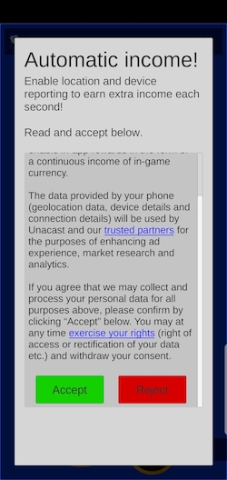
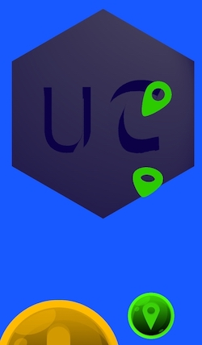

# Clicker Example
This simple clicker games incentivises the user to turn on location tracking by rewarding they player with a continuous stream of income 
as long as tracking is turned on.

## Game Design/Features
The game is a basic clicker game:
1. Click the button to gain gems (the in-game currency).
2. Spend gems to upgrade your income, increasing the amount of gems gained with each click.
3. Turn on location and device-tracking to earn automated income.

## SDK Tie-in and user incentive
To incentivise users to turn on location and device reporting through the Unacast Pure SDK, the game awards users with continuous income each second, 
even when the game is closed/paused.

To turn on reporting, the user clicks the "location"-button and is presented with a [GDPR-compliant](https://www.gdpreu.org/the-regulation/key-concepts/consent/) 
opt-in screen where they can read the terms and choose to accept/reject the conditions.

If the user accepts the opt-in text, they are presented with the systems dialog for enabling location.

After the user has accepted the opt-in text and the systems dialog for turning on location, the "location"-button turns green, 
and the automatic income starts, visualized by the now green button emitting a stream of green location markers.

## SDK Code
Connecting the app to the Unacast Pure SDK is done in a few lines of code in the script [`LocationIncome.cs`](Scripts/LocationIncome.cs)

