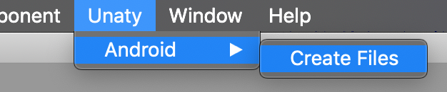

# Unacast Pure SDK Unity SDK
**IMPORTANT: This asset is only useful if you are a registered data partner of Unacast Inc.**

This asset contains Unacast's Pure SDK, along with example code showing how to use the SDK. 
The Unity Pure SDK supplies a cross platform API that allows developers to develop games and application 
in Unity targeting Android and/or iOS using the same code when connecting to the SDK.  

# SDK download

## Git submodule
In your project, enter the  `Assets` directory and add `pure-sdk-unity` as a submodule:
```
git submodule add git@github.com:unacast/pure-sdk-unity.git
```
    
## Manual copy
1. Check out or download `pure-sdk-unity` to a location of your choice.
2. Copy the contents into a sub-directory of your `Assets` in your unity project.

# Android setup
To enable the Pure SDK for Android, unity needs to download and add the SDK as part of the gradle build step. 
To do this, a dependency needs to be added to the project gradle file. 

Unity supports this through adding a custom gradle config under `Assets/Plugins/Android/mainTemplate.gradle`

## No existing `mainTemplate.gradle`.
If do not already have a `mainTemplate.gradle` in your project, you can simple add the custom code using the in-editor context menu:
`Unaty > Android > Create Files`:



This adds a new `mainTemplate.gradle` file to your project, which is automatically picked up by Unity when you build your solution for the Android platform.

## Existing `mainTemplate.gradle`
If you already have a `mainTemplate.gradle` file in your project, you will need to add the dependency manually as descibed below:

### Add repository
As the Pure SDK is hosted on bintray, you will have to add this to the repositories section:

```groovy
allprojects {
    repositories {**ARTIFACTORYREPOSITORY**
        google()
        jcenter()
        maven {
            url 'http://dl.bintray.com/unacast/pure' // <-- Add this
        }         
        flatDir {
            dirs 'libs'
        }
    }
}
``` 

### Add dependency
Add `implementation 'com.unacast.pure:pure-sdk:1.2.28.beta3'` to your `dependencies` section: 

```groovy
dependencies {
    implementation fileTree(dir: 'libs', include: ['*.jar'])
    implementation 'com.unacast.pure:pure-sdk:1.2.28.beta3' // <-- Add this
```
NOTE! Make sure you add this to the `dependencies` section of your project, not your buildscript. 

# iOS Setup
...

# Usage
To be able to use the Unacast Pure SDK you must first [register as a Unacast Data Partner](https://unacastssp.itera-research.com).

## Quick ref

```csharp
using Unaty.PureSDK;
using UnityEngine;

public class ExampleBehaviour : MonoBehaviour
{
    public PureSDKBridge sdk; 
    
    public void DummyUsage()
    {
        sdk.isTracking() // false
        
        // Start tracking and shipping of location data (if user accepts system dialog)
        sdk.startTracking()
        
        sdk.isTracking() // true
        
        // Stop tracking and sending of location data
        sdk.stopTracking() 
        
        sdk.isTracking() // false
    } 
}
```

The `PureSDKBridge` class exposes three functions.

## `startTracking()`
This function start location tracking and shipping of data to the Unacast APIs from the device. If the user has not (yet) accepted 
location usage for the application, a system dialog will be shown, asking permission.

## `stopTracking()`
Stops tracking and sending data to the Unacast APIs. 

## `isTracking()`
Returns `true` if the user has accepted location tracking.

# Folder Structure
Below is a description of the structure and contents of this asset.

## ClickerExample
An example application demonstrating use of the Unacast Pure SDK. 
Open the scene `ClickerExample/UnacastClicker` to test the application.

## Editor
Scripts adding helper functionality to the Unity editor to make it easier to use the SDK.

## Frameworks
The PureSDK code used when building applications targeting iOS.
When building for Android, the SDK is downloaded as part of the Gradle build.

## PureSDK
C# source code the Unacast Pure Unity SDK.
